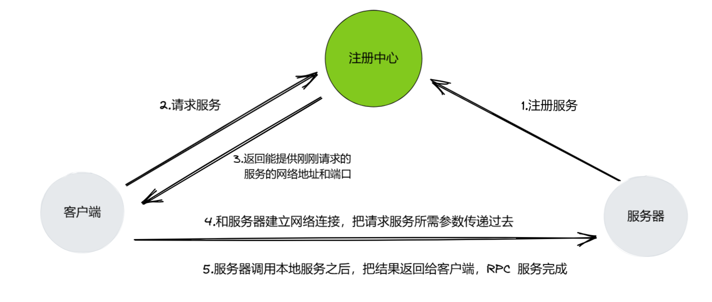
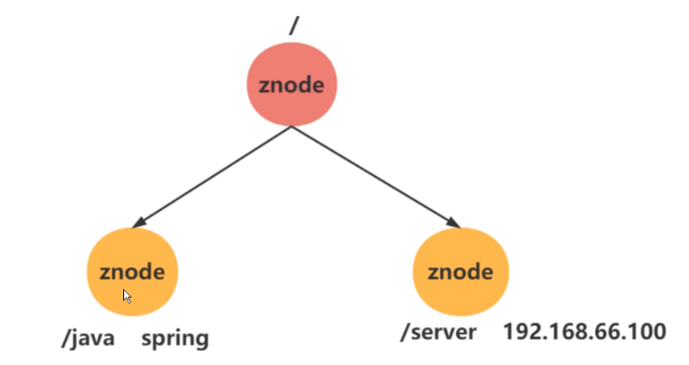
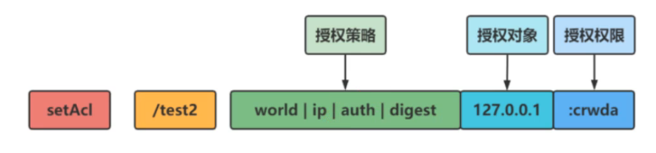
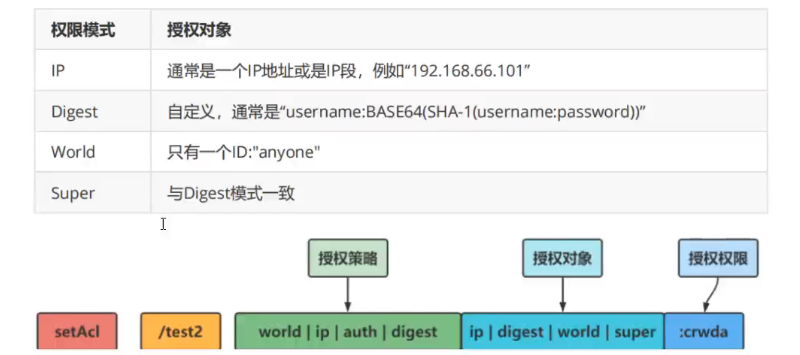
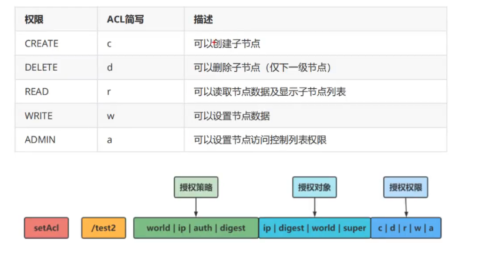
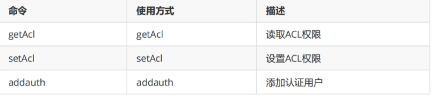

# 依赖

网络库：hv

序列化：protobuf

注册中心：zookeeper

测试框架：gtest

# 如何使用此框架

## 定义通信协议

首先定义好 proto 文件，里面包含需要把本地调用发布成远程调用的相关信息。

比如，你要把本地的 Login 方法 发布成 RPC 调用：

```protobuf
syntax="proto3";
package test;
option cc_generic_services = true;
message ResultCode
{
    int32 errcode=1;
    string errmsg=2;
}
message LoginRequest	// Login 方法的请求参数，客户端需要实际填充的数据，服务器接收
{
    string name=1;
    string pwd=2;
}
message LoginResponse	// Login 调用的相应参数，服务器需要实际填充的数据，客户端接收
{
    ResultCode result=1;
    bool success=2;
}
service UserServiceRpc
{
    rpc Login(LoginRequest) returns(LoginResponse);	// 定义的 RPC方法
}
```

## 服务器发布 RPC 调用

继承前面 proto 定义的 RPC 方法 UserServiceRpc，并重写。

其中，本地方法 Login 属于在没有考虑 RPC 之前的业务函数；而接下来的 Login 方法是重写 protobuf 生成的代码，在内部把本地方法 Login 需要的参数取出来之后，在本地调用，并把执行结果返回。

```c++
class UserService : public test::UserServiceRpc {
 public:

  // 本地服务，在没有考虑分布式之前，单体架构下的本地服务调用
  bool Login(const std::string &name, const std::string &pwd) {	// 本地方法
	  std::cout << "doing local service: Login" << std::endl;
	  std::cout << "name: " << name << "pwd: " << pwd << std::endl;
	  return true;
  }

  // Rpc 服务，但还需要注册
  void Login(::google::protobuf::RpcController *controller,		// RPC 方法
			 const ::test::LoginRequest *request,
			 ::test::LoginResponse *response,
			 ::google::protobuf::Closure *done) override {
	  // 业务逻辑
	  std::cout << "doing remote service: Login" << std::endl;
	  const auto &name = request->name();
	  const auto &pwd = request->pwd();
	  std::cout << "name: " << name << "pwd: " << pwd << std::endl;
	  auto login_result = Login(name, pwd);
	  test::ResultCode *code = response->mutable_result();
	  if (login_result) {
		  code->set_errcode(0);
		  code->set_errmsg("login success");
	  } else {
		  code->set_errcode(1);
		  code->set_errmsg("login failed");
	  }
	  done->Run();
  }
};
```

但这还不够，服务器需要把实现注册，注册到 zookeeper 中：

```c++
int main() {
	// 注册服务
	RpcProvider provider;
	provider.NotifyService(new UserService());
	provider.Run();
	return 0;
}
```

通过 RpcProvider 对象提供的方法注册。

## 客户端发起 RPC 请求

proto 中定义的 RPC 方法 UserServiceRpc 需要服务器去重写并注册，相应的 UserServiceRpc_Stub 需要客户端去实例化并传入一个 RpcChannel（后面会详细讲，现在简单理解为和服务器通信），然后把需要调用 Login 方法所需要的参数给准备好，调用 UserServiceRpc_Stub 的 Login 方法即可。

```c++
int main() {

	auto channel = new RpcChannel();
	test::UserServiceRpc_Stub rpc_stub(channel);

    // 准备参数
	test::LoginRequest login_request;
	login_request.set_name("xy");
	login_request.set_pwd("123");

	test::LoginResponse login_response;

	std::cout << "rpc login request" << std::endl;

    // 发起 RPC 请求
	RpcController rpc_controller;
	rpc_stub.Login(&rpc_controller, &login_request, &login_response, nullptr);

	return 0;
}
```

# 什么是 RPC

RPC（Remote Procedure Call，远程过程调用）是一种计算机通信**协议**，允许程序在不同的地址空间（如不同的计算机或进程）之间调用函数，就像调用本地函数一样。RPC 主要用于分布式系统，使得开发者可以像调用本地方法一样调用远程服务器上的方法，而无需关心底层的网络通信细节。

如果要实现一个轻量级 RPC 需要准备：

- 用于通信的网络库。使用 RPC 框架者无需关心这个问题，但实现 RPC 框架者不得不把整个网络通信给完成，即客户端和服务器的通信。客户端把需要调用的服务的方法和参数给到服务器的这个过程用户不知情，只知道在本地调用了一个方法，然后拿到一个函数执行的结果，尽管是服务器那边调用本地方法执行完成之后返回过来的。
- 序列化和反学历化。使用 RPC 框架者无需关心这个问题，但实现 RPC 框架者不得不把整个参数的序列化和反序列化给完成。客户端只需要如实的把调用的 RPC 方法的参数填充完成即可，后续工作就不用关注了。
- RPC方法的注册（服务注册）。总不能把方法注册到提供服务的内存中吧，如果这台服务器死掉，那可怎么办？需要一个单独的服务器提供注册中心。服务器把自己的服务主动注册到注册中心，服务器如果挂掉会主动把注册的服务从注册中心移除。需要调用服务器注册的服务就访问注册中心，注册中心就返回给你提供相应方法的服务器的相关信息（比如服务器网络地址和端口），拿着这个信息就可以访问服务器的 RPC 方法了。



# 框架思路梳理

## utils 文件夹

配置文件解析：把配置文件信息读入内存，需要获取 value，通过 get 方法提供 key 即可。

hv 协议解析：以头部（4 字节）+实际数据组成，提供把一个字符串打包，把打包后的字符串进行拆包的两个操作。

异步日志：日志内容异步写入文件中，并且在终端输出。

Zookeeper 客户端封装：为方便使用 Zookeeper，把官方提供的接口封装一下。

## proto 文件夹

定义传递 服务名、方法名和方法所需参数的长度：

```protobuf
syntax="proto3";
package tinyrpc;
message RpcHeader
{
    string service_name=1;
    string method_name=2;
    uint32 args_len=3;
}
```

## rpc 文件夹（核心）

RpcProvider 给服务器用来发布 RPC方法，RpcChannel 给客户端用来发起RPC 方法。

而 RpcController 是一个辅助，用来记录 RPC 调用失败的信息。因此，RpcProvider  和 RpcChannel最核心。

### RpcChannel

只需要重写 public google::protobuf::RpcChannel 中的 CallMethod 方法。

因为我们会看到 protobuf 把 proto 文件中的 RPC 方法 生成 .cpp 文件之后，UserServiceRpc_Stub::Login 这个客户端原来发起 RPC 请求的 Login 方法内部会自动调用 CallMethod。

```
void UserServiceRpc_Stub::Login(::PROTOBUF_NAMESPACE_ID::RpcController* controller,
                              const ::test::LoginRequest* request,
                              ::test::LoginResponse* response,
                              ::google::protobuf::Closure* done) {
  channel_->CallMethod(descriptor()->method(0),
                       controller, request, response, done);
}
```

那我们就注重来看看我们如何实现 CallMethod 的：

1. 填充 tinyrpc::RpcHeader，即服务名、方法名以及方法所需参数的长度，返回序列化为字符串 rpc_header_str
2. 把 rpc_header_str 调用 hv 协议解析提供的 packMessageAsString 打包为 send_str，再把 send_str 和 方法所需参数 args_str 拼接在一起，再次用 packMessageAsString 打包为 new_send_str
3. 你可能疑惑 args_str  从何而来，注意看 CallMethod 方法的 request 的参数，这是由客户端自行提供的 proto 文件中定义，我们只需要通过 request 提供的 SerializeToString 方法解析出来即可
4. 由于我们由 服务名和方法名，自然就可以拼接处 zookeeper 中的请求路径，即`"/" + service_name + "/" + method_name`
5. 然后连接 zookeeper  服务器，访问此路径，返回提供 RPC 服务的实际服务器的网络地址和端口，客户端就与之建立连接并 发起 RPC 请求，等待响应
6. 服务器响应之后，就会触发 onMessage 回调，回调中处理服务器响应
7. 一次 RPC 服务就请求完成

### RpcProvider

```c++
class RpcProvider {
 public:
  void NotifyService(google::protobuf::Service *service);
  void Run();
  void OnConnection(const hv::SocketChannelPtr &conn);
  void OnMessage(const hv::SocketChannelPtr &conn, hv::Buffer *buf);
  void SendRpcResponse(const hv::SocketChannelPtr &conn, google::protobuf::Message *response);
 private:
  unpack_setting_t *server_unpack_setting;
  struct ServiceInfo {
	google::protobuf::Service *service_ptr;
	std::unordered_map<std::string, const google::protobuf::MethodDescriptor *> method_dic;
  };
  std::unordered_map<std::string, ServiceInfo> service_dic;    // 存储所有注册的 RPC 服务，方便后续根据服务名找到对应的方法
};
```

Run 方法就是启动 TCP 服务器，等待客户端的连接，因此 OnConnection 是建立连接的回调，OnMessage 是读取客户端消息的回调。

当然，Run 方法 中还连接 zookeeper 注册中心，后面要把发布的 RPC 方法记录 注册到 zookeeper 注册中心。

所以，在调用 Run 方法之前，就得通过 NotifyService 方法把 RPC 方法注册到 service_dic 和 method_dic 容器中。

&nbsp;

OnMessage 是处理客户端发生来的消息，是非常关键的一个成员方法。

- 拆包得到前面 proto 文件定义的协议信息 tinyrpc::RpcHeader，然后反序列化得到 服务名、方法名和参数长度。通过参数长度再把调用方法实际需要的参数取出来（此时还不能直接使用，需要后面解析）
- 遍历 service_dic 和 method_dic 容器 取出 服务信息和方法信息
- 获取 request ，并调用提供的 ParseFromString 方法获取调用方法实际需要的参数解析出来
- 再填充 google::protobuf::NewCallback  得到一个可调用对象 done，其中有个参数是 要填一个调用本地方法成功之后，回复客户端的回调函数，这个需要由我们自己实现，即 SendRpcResponse
- 用于如上参数之后，就可以调用服务对象的 CallMethod 方法，处理客户端的 RPC 请求，并回复处理结果

```c++
service->CallMethod(method, nullptr, request, response, done);
```

# 单体-集群-分布式

单体：所有功能模块（如用户管理、订单管理、支付等）都集中在一个应用程序中，通常部署为一个整体。

集群：将多个相同或相似的应用实例部署在多台服务器上，通过负载均衡来分发请求，从而提高系统的并发能力和可用性。

分布式：将系统拆分成多个服务或模块，每个模块可以独立部署、扩展，并通过网络通信（如 HTTP、RPC、消息队列等）进行交互。

更多内容可阅读：[分布式架构设计](https://xiaoyangst.github.io/posts/35781f65.html)

# 其他 RPC 框架 

## grpc


## srpc

# Zookeeper教程

## 数据模型

ZooKeeper 数据模型的结构与 Unix 文件系统很类似，整体上可以看作是一棵树，每个节点称做一个 ZNode。

每个 ZNode 节点都可以保存数据，每一个 ZNode 默认能够存储 1MB 的数据。

每个 ZNode 都可以通过其路径唯一标识，每个节点都有一个版本，版本从 0 开始计数。



是以 key-value 的形式存储数据，如图中 key 是 /java ，value 是 spring。

## 节点特性

### 持久节点

**创建后即使客户端断开连接也不会自动删除**，只有显式删除时才会被移除。

**特性**：

- 适用于 **共享配置信息、分布式协调** 等场景
- 需要显式删除
- 适用于长期存储数据

### 临时节点

**会在创建它的客户端断开连接后自动删除**，常用于 **临时信息存储**，如 **服务注册、心跳检测**。

**特性**：

- 适用于 **服务发现**，当服务掉线时节点会自动删除
- 不能创建子节点
- 只能由创建它的客户端删除（或断开连接后自动删除）

### 有序节点

有序节点在创建时，Zookeeper **会在节点名称后自动追加递增的数字**，适用于 **分布式锁、Leader 选举** 等场景。

**特性**：

- Zookeeper 维护一个 **单调递增的序列号**
- 适用于 **任务队列、分布式锁、Leader 选举**
- 可结合 **持久或临时节点**

&nbsp;

注：还有临时有序和持久有序，看名字就知道何意，不多说明。

## 节点操作

| 操作             | 命令示例                 | 说明                 |
| ---------------- | ------------------------ | -------------------- |
| **创建节点**     | `create /node "data"`    | 创建持久节点         |
| **创建临时节点** | `create -e /node "data"` | 连接断开后自动删除   |
| **创建有序节点** | `create -s /node "data"` | 生成带递增编号的节点 |
| **查看数据**     | `get /node`              | 读取节点数据         |
| **查看子节点**   | `ls /`                   | 列出所有子节点       |
| **修改数据**     | `set /node "new data"`   | 更新节点内容         |
| **删除节点**     | `delete /node`           | 删除空节点           |
| **删除非空节点** | `deleteall /node`        | 递归删除子节点       |
| **查看节点信息** | `stat /node`             | 查看节点元数据       |

## 版本号介绍

帮助 Zookeeper 保证 **数据一致性** 和 **并发操作** 的正确性。

在 ZooKeeper 中的 version 属性就是用来实现乐观锁机制中的“校验”的，ZooKeeper 每个节点都有数据版本的概念，在调用更新操作的时候，假如有一个客户端试图进行更新操作，它会携带上次获取到的 version 值进行更新。而如果在这段时间内，ZooKeeper 服务器上该节点的数值恰好已经被其他客户端更新了，那么其数据版本一定也会发生变化，因此肯定与客户端携带的 version 无法匹配，便无法成功更新，因此可以有效地避免一些分布式更新的并发问题。

在 ZooKeeper 的底层实现中，当服务端处理 setDataRequest 请求时，首先会进行数据版本校验。ZooKeeper 会从 setDataRequest 请求中获取当前请求的版本 version，同时获取服务器数据记录 nodeRecord， 从中得到当前服务器上的版本信息 currentversion。如果 version 为 -1，表示该请求操作不使用乐观锁，可以忽略版本对比；如果 version 不是 -1，那么就对比 version 和 currentversion，如果相等，则进行更新操作，否则就会抛出异常中断操作。

## 监听机制实现分布式通知

用于监控 Znode（节点）上的 **数据变化** 或 **节点变化**。监听机制是一种 **异步通知** 机制，允许客户端在指定的节点上设置监听器，一旦节点发生变化，Zookeeper 会主动通知客户端。

**Watcher**：Watcher 是 Zookeeper 中的一个接口，它定义了监听事件的处理逻辑。通过设置 Watcher，Zookeeper 会监听某个节点的事件，当发生变更时，自动触发事件的回调。

**一次性监听**：Zookeeper 提供的监听器是 **一次性的**，即当事件触发时，客户端会接收到通知，然后监听就会自动取消。如果需要继续监听，需要重新设置监听器。

### 事件类型

**(1) 节点数据变化事件**

当一个节点的数据发生变化时，触发该事件。

- **数据变化（DATA_CHANGED）**：当节点数据被修改时，触发该事件。
- **节点删除（NODE_DELETED）**：当节点被删除时，触发该事件。

**(2) 节点子节点变化事件**

当一个节点的子节点发生变化时，触发该事件。

- **子节点增加（NODE_ADDED）**：当节点有子节点增加时，触发该事件。
- **子节点删除（NODE_DELETED）**：当节点的子节点被删除时，触发该事件。

**(3) 节点存在状态变化事件**

当一个节点的 **存在状态** 发生变化时，触发该事件。

- **节点存在（NODE_CREATED）**：节点的状态从 **不存在** 变为 **存在**。
- **节点不存在（NODE_DELETED）**：节点的状态从 **存在** 变为 **不存在**。

### 应用场景

**配置管理**：Zookeeper 可以监控配置文件的变化，并通知所有客户端进行配置更新，保证各个客户端配置一致。

**服务发现**：Zookeeper 可以监控服务的增减，帮助客户端实时发现可用的服务。

**分布式锁**：通过监控节点的变化，Zookeeper 可以实现分布式锁机制，避免多客户端竞争资源。

**动态负载均衡**：Zookeeper 监听节点变化可以帮助动态调整负载均衡策略，比如在节点发生故障时，及时更新负载均衡策略。

## 权限控制

### ACL 权限控制介绍

**ACL** 机制基于 **用户名（身份）** 和 **权限（操作）** 来控制对 Znode 节点的访问。每个节点都有一组 **ACL 规则**，规定哪些客户端可以对该节点进行特定操作。ACL 主要包括以下要素：

- **身份（ID）**：用于标识访问者的身份。
- **权限（Permissions）**：授予用户的权限类型。
- **ACL 类型**：用于定义特定类型的身份验证和权限控制策略。

### 授权策略



Zookeeper 主要基于 **Scheme** 进行授权，常见的 Scheme 类型包括：

- **world**：所有用户
- **auth**：已认证的用户（适用于 `digest` 认证）
- **digest**：基于用户名和密码的身份验证
- **ip**：基于 IP 地址的授权

### 授权对象

授权对象和授权策略的选择有联系：



比方说你选择 ip 授权策略，你授权对象得上 IP 或者 IP 段，而不是其他的。

### 权限



### 权限相关命令



## 选取机制

Zookeeper 的选举过程通常有两种情况：

1. **集群启动时的选举**
2. **Leader 故障后的重新选举**

### 集群启动时的选举

- 当多个 Zookeeper 服务器启动时，它们之间不会有 Leader，所有节点都处于 **LOOKING（选举中）** 状态。
- 每个节点会向其他节点发送 **投票**，投票的内容包括：
  - **自身的 ServerID**
  - **事务 ID（ZXID）**
- 选举规则：
  - **优先选择 ZXID 更大的服务器**（表示数据更完整）。
  - 如果 ZXID 相同，则比较 **ServerID**，数值较大的服务器当选。
- 当某个服务器获得超过半数（`N/2 + 1`）的支持票后，它成为 **Leader**，其他节点成为 **Follower**（或 Observer）。

### Leader 故障后的重新选举

- 发生 **Leader 崩溃、网络分区或 Leader 失去半数以上 Follower** 时，需要重新选举。
- Follower 进入 **LOOKING** 状态并重新开始投票，采用相同的选举规则进行 Leader 选举。

### 选举算法

Zookeeper 主要使用 **Fast Leader Election（FLE）快速选举算法**：

- **阶段 1**：所有节点进入 `LOOKING` 状态，并向其他节点发送投票。
- **阶段 2**：根据 **ZXID** 和 **ServerID** 进行比较，选择优先级最高的节点。
- **阶段 3**：当某个节点获得 **过半数选票**，它成为 **Leader**，其他节点变为 **Follower**。

## 客户端使用

我是自己封装的，在 github 上也有看到一个封装的，但我没有用。

感兴趣的可以看看：https://github.com/tgockel/zookeeper-cpp

